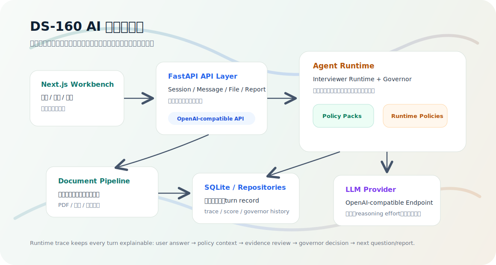

# DS-160 AI 面签模拟器

> 面向美国非移民签证场景的 AI 面签工作台：用多轮追问、材料核验和风险报告，帮助申请人更早发现 DS-160 叙事中的漏洞、缺证和不一致。



## 授权协议：禁止商用

本仓库采用“源码可见、非商业使用”的自定义许可，完整条款见 [LICENSE](LICENSE)。这不是 MIT、Apache、GPL 等开放商用开源协议。

允许：

- 个人学习、研究、教学、内部评估和非商业原型验证
- 在非商业场景下复制、修改、运行和分发，但必须保留 [LICENSE](LICENSE) 与版权声明

禁止：

- 未经书面授权用于付费产品、SaaS、咨询交付、商业内部系统或客户项目
- 将代码、文档、提示词、测试数据或界面资源用于商业模型训练、商业数据产品或其他营利业务
- 通过广告、订阅、交易抽成、引流销售等方式直接或间接商业化

如需商业使用、商业部署或商业集成，必须先取得版权所有者的书面商业授权。

## ✨ 项目定位

DS-160 AI 面签模拟器不是一个普通聊天机器人。它更像一个“签证面谈推演工作台”：用户选择签证类型后，系统会围绕 DS-160 信息、赴美目的、资金来源、学习/工作计划、回国约束和材料证据展开追问，并在每一轮对话后动态更新风险判断。

项目当前重点服务于内部测试和原型验证，适合用于：

- 🎙️ 模拟真实签证官式追问，而不是泛泛聊天
- 📄 上传 I-20、offer、资金证明、在读证明等材料并做结构化理解
- 🔎 接入服务端 RAG 知识库，优先引用官方政策、领馆页面和互惠表信息
- 🧭 识别当前回答中的缺证、冲突、不完整解释和高风险信号
- 📊 生成面向用户的准备建议和面向内部调试的运行报告
- 🧪 验证 Agent runtime、材料理解、RAG 检索、Governor 护栏和前端工作台体验

## 🧠 核心体验

用户看到的是一个签证准备工作台：

- 左侧是会话、历史、材料和设置入口
- 中间是面签式问答流
- 右侧是实时分析面板，展示风险、缺失材料和下一步建议
- 上传材料后，系统会判断材料是否支持当前主线，而不是要求用户先手动分类
- 会话结束或阶段性复盘时，可以生成用户报告和内部分析报告

后端看到的是一条可追踪的 Agent 运行链路：

- 每轮输入都会进入会话编排层
- runtime 会结合历史、材料、签证规则和当前风险生成下一步动作
- Governor 决定继续追问、要求补证、进入高风险复核或模拟拒签
- trace、score、document review 和 turn record 会沉淀到数据库，方便复盘

## 🏗️ 系统架构

项目采用“前端工作台 + FastAPI 单体后端 + Agent runtime + OpenAI-compatible 模型网关”的架构。

```text
Next.js Workbench
        │
        ▼
FastAPI API Layer
        │
        ▼
Message / File / Report Services
        │
        ▼
Interviewer Runtime + Governor + Capability Orchestrator
        │
        ├── Policy Packs / Runtime Policies
        ├── Visa Policy RAG / Chroma / SiliconFlow
        ├── Document Pipeline / Evidence Repository
        ├── Runtime Ledger / Turn Records
        └── OpenAI-compatible LLM Provider
```

### 架构分层

| 层级 | 作用 |
| --- | --- |
| `web/` | Next.js 前端工作台，负责会话、材料、报告、历史和鉴权体验 |
| `app/api/routers/` | FastAPI 路由层，对外暴露 session、message、file、report、auth 等接口 |
| `app/services/` | 业务编排层，承载面谈 runtime、材料处理、报告生成和状态同步 |
| `app/agents/` | Agent 运行单元，负责问题生成、材料复核、裁决和结构化输出 |
| `app/domain/` | 领域模型与跨层合同，例如运行状态、证据模型和决策结构 |
| `app/integrations/` | 外部模型、embedding、rerank、文件解析等集成适配 |
| `app/repositories/` | 数据访问层，封装会话、材料和 turn record 的持久化 |
| `app/runtime_policies/` | 模型供应商、模型名称、reasoning effort 等运行时配置 |
| `app/policy_packs/` | 不同签证类型的规则包，例如 F-1、J-1、B-1/B-2 等 |

## 🔁 一轮面谈如何运行

1. 用户在前端发送回答或上传材料。
2. FastAPI 接收请求，并由 `MessageService` 或 `FileService` 接管。
3. `GateRuntimeService` 刷新签证家族和材料准备进度，但不接管面谈主线。
4. `InterviewerRuntimeService` 结合历史、材料、风险分数和签证规则分析当前回合。
5. `CapabilityOrchestrator` 按需触发材料评估、证据检索、一致性复核等能力。
6. LLM turn decision 生成下一步主动作；Governor 只负责高风险、拒签等边界护栏。
7. 系统返回下一句面谈问题，并同步更新 runtime view、trace、score、gate progress 和报告上下文。

## 🧩 关键设计

### 🎯 LLM-first 面谈 Runtime

系统把模型放在面谈主循环中，但不会让模型直接裸奔。模型输出会被结构化 schema、runtime projector、Governor 和报告合同约束，确保前端、报告和测试能消费稳定字段。

### 🛂 Governor 护栏

Governor 负责把“模型想问什么”和“签证场景不能越过的边界”分开。它保留高风险复核、模拟拒签和会话关闭等护栏职责，但不再根据材料门控状态覆盖面试官 Agent 的主回复。

### 🚦 Gate 只做辅助进度

Gate 的职责是选择签证家族、维护最低材料包进度，并在 API 响应中提供 `gate_progress`。除 `family_not_selected` 之外，材料缺失、材料解析中或最低字段未齐都不会阻断 `InterviewerRuntimeService`；面试官 Agent 仍会继续根据当前上下文判断是否追问、要求补材料或继续面谈。

主线请求材料只来自 LLM turn decision 的显式输出：

- `decision=need_more_evidence`
- `requested_documents` 或 `focus_document_type` 明确指出当前关键材料

Gate primary document、`score.missing_evidence`、document review 建议和 governor requested docs 都只能作为 advisory/support 信息，不能回填成主线 `requested_documents`、`phase_state` 或报告主状态。更完整的运行时合同见 [Runtime Contracts](docs/runtime-contracts.md)。

### 📄 材料理解与证据主线

材料上传不是简单存文件。系统会提取材料内容、判断材料类型、评估材料是否支持当前回答，并把材料反馈合并进后续追问和报告。

### 🧪 调试材料包

本地或受控测试环境可以开启 `ALLOW_DEBUG_FILL=true`，让前端从“材料包”菜单生成 F-1 synthetic 材料包。材料包会一次性写入多份可见材料、结构化字段和证据 chunk，用来测试材料库、document review、Governor 和前端交互。

材料正文会模拟 DS-160 确认页、护照 OCR、I-20、录取信、银行证明和亲属关系证明的真实文本形态；所有人名、学校、证件号和机构名仍使用明显合成占位值。

当前支持：

- `normal_f1_bundle`：自洽基准材料
- `school_mismatch_bundle`：I-20 与录取信学校不一致
- `identity_mismatch_bundle`：DS-160 与护照号码不一致
- `funding_shortfall_bundle`：资金证明低于 I-20 第一年度费用
- `sponsor_chain_gap_bundle`：父母股权资金来源缺少独立链路证明
- `claim_vs_document_bundle`：口头资金来源与材料不一致

调试材料包的 `expected_findings` 只作为 API 测试参考和前端材料详情里的“核验线索”展示，不写入材料正文、证据 excerpt、profile，也不进入 document review prompt/context。document review 必须基于材料字段、材料正文和口头 claim 自己判断缺陷。

### 🧾 可复盘运行记录

每一轮都会沉淀 turn record、runtime trace、score history 和 governor history。这样做的目的不是只看最终回复，而是能解释“系统为什么这样追问”。

### 🔌 OpenAI-compatible 模型接入

项目通过 `OPENAI_BASE_URL` 和 `OPENAI_API_KEY` 接入兼容 OpenAI 协议的模型服务，便于在不同模型供应商之间切换。

### 🔎 美签政策 RAG

RAG 是服务端能力，不使用前端用户填写的对话模型配置。当前实现使用 Chroma 作为向量库，使用硅基流动提供 embedding 和 rerank：

- `GET /v1/rag/status`：返回知识库是否关闭、未配置、可用、索引为空或索引不可访问。
- `POST /v1/rag/files`：上传知识库文件，前端可选填写标题、来源链接、签证类型、国家、领馆/地区和备注。
- 公共上传入口固定写入 `third_party_reference`，不会把用户上传文件提升为官方来源。
- 官方、领馆和国家互惠表资料应通过受控导入流程写入，避免污染高权威集合。
- 检索时会优先使用官方来源；第三方资料默认只作为研发参考，除非显式开启 `RAG_ALLOW_THIRD_PARTY_REFERENCE=true`。

### 🧑‍💻 用户自带模型配置（BYOK）

自行部署时可以开启用户自带模型配置。开启后，前端设置面板允许用户填写自己的 OpenAI-compatible `Base URL`、`API Key` 和 `Model`，后端仍负责 DS-160 编排、材料状态、Governor、报告和会话保存。

需要注意：

- BYOK 是“使用用户自己的模型服务”，不是“纯前端本地运行”。
- 聊天记录、材料记录和报告仍保存在当前部署的后端数据库中。
- 用户填写的 API Key 只随请求发送给后端代理使用，不写入后端数据库。
- 前端不会把 API Key 持久化到 `localStorage`，刷新页面后需要重新填写。
- 当前流式输出是事件式 SSE，展示处理阶段和最终结果；不是 token 级逐字流。线上反代必须禁用 SSE 缓冲，否则前端会等到后端完成后才一次性收到事件。

## 🛠️ 技术栈

| 模块 | 技术 |
| --- | --- |
| 前端 | Next.js 16、React 19、TypeScript、Tailwind CSS、Radix UI |
| 后端 | Python 3.12、FastAPI、Pydantic v2、SQLAlchemy |
| Agent | `pydantic-ai-slim[openai]`、结构化 schema、runtime policies |
| RAG | Chroma、SiliconFlow Embedding、SiliconFlow Rerank |
| 存储 | SQLite 默认落地，可通过 `DATABASE_URL` 替换；RAG 向量索引默认落在 `data/chroma/us_visa` |
| 部署 | Docker、Docker Compose、一体化前后端镜像 |
| 测试 | pytest、integration tests、可选 live LLM tests |

## 🚀 快速启动

### 1. 准备后端环境

```bash
uv sync --dev
cp .env.example .env
```

至少配置：

```env
OPENAI_BASE_URL=https://your-openai-compatible-endpoint/v1
OPENAI_API_KEY=your-api-key
```

常用可选项：

```env
APP_AUTH_PASSWORD=
APP_AUTH_SESSION_TTL_SECONDS=86400
APP_AUTH_IDLE_TIMEOUT_SECONDS=28800
APP_AUTH_COOKIE_SECURE=true
APP_AUTH_COOKIE_SAMESITE=lax
APP_AUTH_PROTECT_DOCS=true
APP_COMPAT_API_KEY=
MULTIMODAL_EXTRACTION_ENABLED=true
DATABASE_URL=sqlite:///./app.sqlite3
CORS_ALLOW_ORIGINS=http://localhost:3000,http://127.0.0.1:3000
ALLOW_USER_MODEL_CONFIG=false
ALLOW_USER_MODEL_STREAMING=false
ALLOW_DEBUG_FILL=false
```

如果要允许用户在前端设置自己的模型服务：

```env
ALLOW_USER_MODEL_CONFIG=true
ALLOW_USER_MODEL_STREAMING=true
```

如果要开启服务端 RAG：

```env
RAG_ENABLED=true
RAG_CHROMA_PATH=./data/chroma/us_visa
SILICONFLOW_BASE_URL=https://api.siliconflow.cn/v1
SILICONFLOW_API_KEY=your-siliconflow-api-key
SILICONFLOW_EMBEDDING_MODEL=BAAI/bge-m3
SILICONFLOW_RERANK_MODEL=Qwen/Qwen3-Reranker-4B
```

RAG 与 BYOK 的职责边界：

- `ALLOW_USER_MODEL_CONFIG` 只影响用户对话模型。
- `RAG_*` 和 `SILICONFLOW_*` 只由服务端读取。
- 前端设置页只展示 RAG 状态和上传入口，不允许用户覆盖服务端 embedding/rerank 配置。

### 2. 启动前后端

推荐使用一键开发命令：

```bash
make dev
```

默认地址：

- 前端工作台：`http://127.0.0.1:3000`
- 后端 API：`http://127.0.0.1:8000`
- 健康检查：`http://127.0.0.1:8000/healthz`

如果端口冲突：

```bash
API_PORT=8001 WEB_PORT=3001 make dev
```

## 🐳 Docker 部署

项目提供一体化 Docker 镜像，容器内同时运行 FastAPI 和 Next.js，浏览器只需要访问前端端口。

```bash
docker build -t ds160-agent2:latest .
```

```bash
docker run -d --name ds160-agent2 \
  -p 3000:3000 \
  -v ds160-agent2-data:/data \
  -e APP_AUTH_PASSWORD='change-me' \
  -e OPENAI_BASE_URL='https://your-openai-compatible-endpoint/v1' \
  -e OPENAI_API_KEY='your-api-key' \
  ds160-agent2:latest
```

也可以使用 Compose：

```bash
APP_AUTH_PASSWORD='change-me' \
OPENAI_BASE_URL='https://your-openai-compatible-endpoint/v1' \
OPENAI_API_KEY='your-api-key' \
docker compose up -d --build
```

## 🔐 访问保护

服务器测试阶段可以通过一个共享入口密码保护主要业务接口。登录后后端会创建服务端会话，并通过 `HttpOnly` Cookie 访问业务 API；前端不再保存长期 Bearer token。

- `APP_AUTH_PASSWORD` 为空时关闭鉴权，方便本地开发
- 设置 `APP_AUTH_PASSWORD` 后，前端会先调用 `POST /v1/auth/login`
- 登录成功后浏览器通过 `HttpOnly; Secure; SameSite` Cookie 访问受保护接口
- `POST /v1/auth/logout` 会撤销当前服务端会话并清理 Cookie
- 生产环境默认保护 `/docs`、`/redoc`、`/openapi.json`，可通过 `APP_AUTH_PROTECT_DOCS=false` 调整
- `POST /v1/chat/completions` 如需被外部机器客户端直连，应单独配置 `APP_COMPAT_API_KEY` 并使用 `Authorization: Bearer <token>`

这只是测试阶段的进入保护，不是完整用户系统。当前不包含用户注册、权限分级或多租户隔离。

## 📡 主要 API

完整请求/响应、认证方式、错误码和示例见 [API Reference](docs/API.md)。

| 接口 | 作用 |
| --- | --- |
| `POST /v1/auth/login` | 建立服务端登录会话 |
| `GET /v1/auth/me` | 查询当前登录状态 |
| `POST /v1/auth/logout` | 撤销当前登录会话 |
| `POST /v1/sessions` | 创建签证模拟会话 |
| `POST /v1/sessions/{session_id}/messages` | 提交一轮面谈回答 |
| `POST /v1/sessions/{session_id}/messages/stream` | 事件式 SSE 面谈回答 |
| `POST /v1/sessions/{session_id}/debug/material-bundles` | 生成调试材料包 |
| `POST /v1/sessions/{session_id}/debug/material-bundles/stream` | 事件式 SSE 生成调试材料包 |
| `POST /v1/sessions/{session_id}/files` | 上传材料 |
| `POST /v1/model-config/models` | 使用用户模型配置代理拉取 `/v1/models` |
| `GET /v1/rag/status` | 查询服务端知识库状态 |
| `POST /v1/rag/files` | 上传第三方知识库文件并写入 RAG 索引 |
| `GET /v1/sessions/{session_id}/reports/user` | 获取用户报告 |
| `GET /v1/sessions/{session_id}/reports/internal` | 获取内部调试报告 |
| `POST /v1/chat/completions` | OpenAI-compatible 对话入口 |

前端生产镜像通过 `/api` 代理访问后端，所以浏览器侧路径通常是 `/api/v1/...`；后端本身仍暴露 `/v1/...`。

## 🧪 测试

默认测试：

```bash
uv run pytest -q
```

跳过真实模型测试：

```bash
uv run pytest -q -m "not live_llm"
```

真实模型联调测试需要显式提供模型配置：

```bash
RUN_LIVE_LLM_TESTS=1 \
OPENAI_BASE_URL=... \
OPENAI_API_KEY=... \
uv run pytest tests/integration/live -q -m live_llm
```

RAG live 测试需要额外提供硅基流动配置，并确保本地 Chroma 索引已经存在：

```bash
RAG_ENABLED=true \
SILICONFLOW_BASE_URL=https://api.siliconflow.cn/v1 \
SILICONFLOW_API_KEY=... \
uv run pytest tests/integration/live -q -m live_llm
```

## 🗂️ 本地数据与版本控制

以下内容是本地运行产物或可再生成资料，不应直接提交到 Git：

- `data/`：Chroma 向量库、RAG 原始资料、live 测试报告
- `app.sqlite3`：本地 SQLite 数据库
- `.env`：本地密钥和部署配置
- `*_raw_materials_pack.zip`：临时资料包

需要共享知识库时，优先使用受控 artifact、对象存储或重新执行导入流程，不要把 Chroma 二进制索引混进代码提交。
