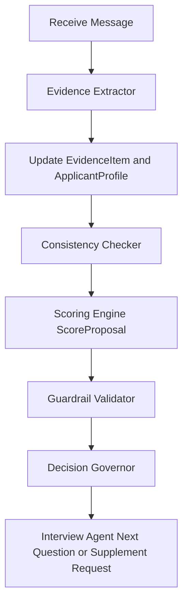
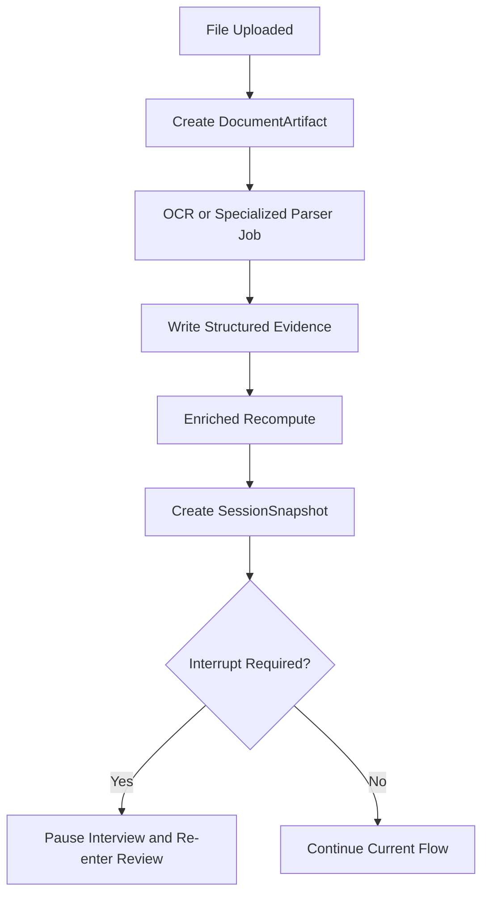

# DS-160 场景美国非移民签证面签模拟器 v1 设计文档

日期：2026-04-17  
状态：已完成设计评审，待用户审阅  
目标读者：产品设计、后端架构、Agent 编排、提示词工程、测试设计

## 1. 背景与目标

本项目要构建一个后端优先、文本驱动、围绕 DS-160 场景的美国非移民签证面签模拟器。  
v1 明确不做语音，前端默认由 LibreChat 或 Open WebUI 承载，因此后端只需要提供聊天兼容 API、文件上传 API、状态查询 API 与报告 API。

v1 的核心目标如下：

- 接受聊天消息与用户上传文件。
- 将聊天与材料解析为结构化证据。
- 维护会话级 `ApplicantProfile`。
- 将用户路由到正确的签证家族与场景模块。
- 检查用户陈述与文档之间的一致性。
- 每轮同步重算 `ScoreState`。
- 通过 `Decision Governor` 保证系统不会基于单个弱信号直接给出过重结论。
- 生成用户可读报告与内部 JSON 追溯报告。

## 2. 范围与非目标

### 2.1 v1 范围

- 支持签证家族：
  - `B1/B2`
  - `F1`
  - `J1`
  - `M1`
  - `H-1B`
  - `L-1A`
  - `L-1B`
  - `O-1`
- 支持文档输入：
  - `PDF`
  - `DOCX`
  - `TXT`
  - `Markdown`
  - `图片`
  - `扫描件 OCR`
- 支持重材料审查：
  - `I-20`
  - `DS-2019`
  - 雇主信
  - 银行流水
  - 成绩单
  - 行程与邀请类材料
- 支持受控补证。
- 支持模块级、阶段级 LLM 模型配置与回退链。
- 支持阶段快照与最终报告。

### 2.2 v1 非目标

- 不做语音对话。
- 不做多租户账号体系。
- 不做复杂权限模型。
- 不做真实人工复核流程。
- 不做分布式多服务拆分。
- 不把 OpenAI 兼容接口当作内部领域接口。

## 3. 已确认产品决策

以下决策已在设计讨论中固定：

- 设计优先，先交付完整设计与契约，再进入实现计划。
- 单租户内部原型。
- 双模式定位，但对外表现为：
  - 正式 interview 全程拟真问答。
  - 教练式解释与改进建议只在结束后报告中给出。
- 对外采用双层接口：
  - 内部为领域 API。
  - 外部增加 OpenAI 兼容适配层。
- 文件解析采用重材料审查型设计。
- 判断范式采用：
  - 提取与候选判断由 LLM 主导。
  - 规则层负责证据约束、最终校验与 Governor 裁决。
- 路由策略采用：
  - 候选签证家族并行评估。
  - 达到阈值后锁定主模块。
- 开场采用强门控：
  - 初始必需材料包未解析完成前，不进入正式 interview。
- 前端始终是一个 chat，会话内部采用多阶段状态机。
- 正式 interview 之后不允许用户自由堆材料，只允许系统驱动的定向补证。
- 必需材料包采用：
  - 签证家族固定基线。
  - 场景分支叠加。
- `high_risk_review` 仅作为内部状态存在。
- 报告采用：
  - 阶段快照。
  - 最终用户报告。
  - 最终内部 JSON report。
- 总体技术方案采用：
  - 模块化单体。
  - 提示词中心。
  - 硬护栏兜底。

## 4. 核心原则与硬约束

### 4.1 事实与证据原则

- 不允许无依据推断。
- 所有负面结论必须附 `evidence_refs`。
- 缺失证据必须标记为 `unknown` 或 `missing_evidence`，不能标记为 `false`。
- `ApplicantProfile` 是当前已确认事实视图，不是原始真相。
- 真正可追溯的最小单位是 `EvidenceItem`。

### 4.2 决策与治理原则

- 低分本身不能触发 `simulated_refusal`。
- 单个弱信号不能触发 `simulated_refusal`。
- `Decision Governor` 的最终输出由规则护栏层裁决。
- LLM 可以输出候选分析、评分建议、早停候选，但不能越权直接落最终 Governor 决策。
- 对用户的展示允许更克制，但内部状态不能模糊。

### 4.3 拟真问答原则

- 正式 interview 只问一个问题，不给教学性解释。
- 正式 interview 风格简洁、真实、压缩。
- 需要补证时，返回定向补证请求，不继续普通问答。
- 有些规则命中后允许立即早停。
- 有些规则命中后必须先补一个最小确认问题再早停。

## 5. 总体架构

### 5.1 总体方案

v1 采用 `模块化单体 + 显式阶段机 + 工作流图 + 提示词中心 + 硬护栏`。

这样设计的原因如下：

- 相比多服务，更适合当前单租户原型阶段。
- 相比纯规则，更便于后续迭代提示词与 Rubric。
- 相比纯提示词，更能守住审慎治理边界。
- 核心难点在事实、证据、评分与裁决边界，而不是基础设施拆分。

### 5.2 模块边界

系统主要由以下模块组成：

- `Session Orchestrator`
- `Phase / Gate Manager`
- `Interview Agent`
- `Evidence Extractor`
- `Consistency Checker`
- `Scoring Engine`
- `Decision Governor`
- `Applicant Profile Store`
- `Visa Router`
- `Report Builder`
- `Document Ingestion Pipeline`
- `Policy Pack Registry`
- `LLM Runtime Policy Registry`

### 5.3 文档侧链

文档处理是系统的增强侧链，但部分阶段必须同步阻塞：

- 门控阶段的核心起始材料解析必须同步完成。
- OCR、复杂表格解析、专项解析器可进入异步增强链路。
- 异步增强结果如果影响路由、核心事实或早停判断，则触发中断重审。

## 6. 内部阶段机与工作流

### 6.1 会话阶段

前端只看到一个聊天会话，后端内部至少包含以下阶段：

- `intake`
- `gate_review`
- `candidate_routing`
- `routed_interview`
- `post_interview_report`

### 6.2 主工作流


### 6.3 每轮同步链路

正式 interview 每一轮都执行以下同步链路：



### 6.4 异步增强链路



## 7. 受控补证模型

### 7.1 初始材料包

用户首次只允许提交当前签证家族与场景要求的 `required_initial_package`。

### 7.2 正式面试后的材料输入

正式 interview 开始后，不允许用户自由补传材料。  
只有以下情况才允许新增材料：

- 系统发现某个关键事实需要证明。
- 系统发现某个矛盾需要澄清。
- 系统发现某个早停候选需要确认性证据。

### 7.3 补证结果处理

- 若补证影响路由、核心事实或早停判断，立即中断当前 interview 并回到审查态。
- 若补证只是增强性材料，则后台吸收，在下一轮前更新状态。

## 8. 每签证模块的策略模型

### 8.1 统一模块接口

每个签证模块实现统一能力接口，模块只负责“这个签证家族如何看这个案子”，不直接控制会话。

```ts
interface VisaModule {
  module_key: "b1_b2" | "f1" | "j1" | "m1" | "h1b" | "l1a" | "l1b" | "o1";
  supported_scenarios: string[];

  get_required_initial_package(input): RequiredPackageSpec;
  evaluate_entry_gate(input): GateReviewResult;
  propose_route_fit(input): RouteFitProposal;
  extract_family_fields(input): FamilyFieldProposal;
  evaluate_consistency(input): ConsistencyProposal;
  propose_score(input): ScoreProposal;
  detect_terminal_patterns(input): TerminalCheckProposal;
  build_targeted_supplement_request(input): SupplementRequestProposal;
  generate_next_question(input): InterviewTurnProposal;
  build_final_report_insights(input): ModuleReportSection;
}
```

### 8.2 场景分支

- `B1/B2`
  - `tourism`
  - `business_visit`
  - `conference`
  - `family_visit`
- `F1`
  - `self_funded`
  - `parent_sponsored`
  - `other_sponsor`
- `J1`
  - `government_funded`
  - `institution_funded`
  - `self_or_family_supported`
- `M1`
  - `vocational_program`
- `H-1B`
  - `first_time_stamping`
  - `change_employer_context`
  - `renewal_context`
- `L-1A`
  - `manager_executive`
  - `new_office`
- `L-1B`
  - `specialized_knowledge`
- `O-1`
  - `arts_media`
  - `science_business`
  - `agent_petition`

### 8.3 Visa Policy Pack

v1 不再采用刚性 `Rule Pack` 概念，而采用 `Visa Policy Pack`：

- `policy_pack_id`
- `visa_family`
- `scenario_key`
- `required_initial_package`
- `routing_prompt`
- `interview_prompt`
- `scoring_rubric_prompt`
- `consistency_prompt`
- `terminal_pattern_prompt`
- `supplement_request_prompt`
- `governor_guardrails`

解释：

- 大部分判断逻辑、评分 Rubric、追问策略、早停启发式都通过 Prompt 与结构化输出驱动。
- 不可突破的底线通过 `governor_guardrails` 强制校验。

## 9. Early-Termination 设计

### 9.1 目的

不是所有案子都应进入长 interview。  
当某个签证家族的核心不相容事实已被确认时，系统应允许早停。

### 9.2 触发条件

早停必须同时满足以下条件：

- 命中某条 `terminal_pattern`。
- 有明确证据或用户确认。
- 证据引用完整。
- 没有尚未消解的强冲突证据阻断。
- 通过 `Governor Guardrails`。

### 9.3 触发模式

按策略配置：

- 某些模式一经确认立即早停。
- 某些模式必须补一个最小确认问题后才允许早停。

### 9.4 禁止事项

- 不允许因为单个弱信号早停。
- 不允许因为单纯低分早停。
- 不允许因为模型主观猜测早停。

## 10. LLM 运行时策略

### 10.1 目标

每个模块、每个阶段都应可独立配置供应商、模型、提示词版本与回退链。

### 10.2 LLM Runtime Policy

- `module_key`
- `stage_key`
- `provider`
- `model`
- `prompt_template_id`
- `prompt_version`
- `schema_id`
- `timeout_ms`
- `retry_policy`
- `fallback_chain[]`

### 10.3 设计原则

- 允许多供应商切换。
- 允许多模型切换。
- 允许回退链。
- 实际生效快照必须写入内部 report。

### 10.4 典型模块

- `interview_agent`
- `evidence_extractor`
- `consistency_checker`
- `scoring_engine`
- `report_generator`

说明：

- `Decision Governor` 最终裁决仍在规则层。
- LLM 只允许参与候选分析、解释或结构化提案。

## 11. API 设计

### 11.1 领域 API

领域 API 是内部真实接口，表达真实业务对象：

- `POST /v1/sessions`
- `GET /v1/sessions/{id}`
- `POST /v1/sessions/{id}/messages`
- `POST /v1/sessions/{id}/files`
- `GET /v1/sessions/{id}/required-package`
- `GET /v1/sessions/{id}/profile`
- `GET /v1/sessions/{id}/score`
- `GET /v1/sessions/{id}/governor`
- `GET /v1/sessions/{id}/reports/user`
- `GET /v1/sessions/{id}/reports/internal`
- `GET /v1/jobs/{job_id}`
- `GET /v1/policy-packs/{visa_family}`
- `GET /v1/runtime-policies/{module_key}`

### 11.2 OpenAI 兼容适配层

为 LibreChat/Open WebUI 提供兼容入口：

- `POST /v1/chat/completions`
- `POST /v1/files`
- `GET /v1/files/{id}`
- `POST /v1/responses`，可作为预留

兼容层元数据建议包含：

- `metadata.session_id`
- `metadata.phase_state`
- `metadata.file_ids[]`

### 11.3 主消息入口

`POST /v1/sessions/{id}/messages` 负责：

- 写入消息。
- 同步执行提取、核对、评分建议与校验。
- 更新 `ApplicantProfile`、`ScoreState`、`GovernorState`。
- 返回下一问、补证请求或路由修正。

### 11.4 文件入口

`POST /v1/sessions/{id}/files` 负责：

- 建立 `DocumentArtifact`。
- 根据当前阶段与文件类型决定走：
  - 同步门控解析。
  - 异步增强解析。

## 12. 数据模型边界

### 12.1 会话聚合根

`InterviewSession` 是后端聚合根：

- `session_id`
- `phase_state`
- `applicant_profile_id`
- `active_candidate_routes[]`
- `current_score_state_id`
- `current_governor_state_id`
- `required_package_checklist`
- `pending_jobs[]`
- `snapshot_ids[]`

### 12.2 核心对象

- `ApplicantProfile`
- `EvidenceItem`
- `DocumentArtifact`
- `ConsistencyFinding`
- `ScoreState`
- `GovernorState`
- `SessionSnapshot`

### 12.3 三条关键边界

- `Profile` 与 `Evidence` 分离。
- `Proposal` 与最终状态分离。
- `Policy` 与 `Runtime` 分离。

## 13. ApplicantProfile JSON Schema

```json
{
  "$id": "ApplicantProfile",
  "type": "object",
  "required": [
    "profile_id",
    "profile_version",
    "identity",
    "visa_intent",
    "field_states",
    "field_provenance"
  ],
  "properties": {
    "profile_id": { "type": "string" },
    "profile_version": { "type": "integer", "minimum": 1 },
    "identity": {
      "type": "object",
      "properties": {
        "full_name": { "type": ["string", "null"] },
        "date_of_birth": { "type": ["string", "null"], "format": "date" },
        "nationality": { "type": ["string", "null"] },
        "passport_number": { "type": ["string", "null"] }
      }
    },
    "visa_intent": {
      "type": "object",
      "properties": {
        "declared_family": { "type": ["string", "null"] },
        "candidate_families": {
          "type": "array",
          "items": {
            "type": "object",
            "required": ["family", "confidence"],
            "properties": {
              "family": { "type": "string" },
              "confidence": { "type": "number", "minimum": 0, "maximum": 1 }
            }
          }
        },
        "scenario_key": { "type": ["string", "null"] },
        "principal_purpose": { "type": ["string", "null"] }
      }
    },
    "travel": { "type": "object" },
    "education": { "type": "object" },
    "employment": { "type": "object" },
    "funding": { "type": "object" },
    "immigration_history": { "type": "object" },
    "family_social_ties": { "type": "object" },
    "family_specific": {
      "type": "object",
      "description": "签证家族特有字段"
    },
    "ds160_view": {
      "type": "object",
      "description": "映射回 DS-160 视角"
    },
    "field_states": {
      "type": "object",
      "additionalProperties": {
        "type": "object",
        "required": ["state"],
        "properties": {
          "state": {
            "type": "string",
            "enum": ["unknown", "claimed", "documented", "confirmed", "conflicted"]
          },
          "last_updated_at": { "type": "string", "format": "date-time" }
        }
      }
    },
    "field_provenance": {
      "type": "object",
      "additionalProperties": {
        "type": "object",
        "properties": {
          "evidence_refs": {
            "type": "array",
            "items": { "type": "string" }
          },
          "source_summary": { "type": "string" }
        }
      }
    }
  }
}
```

设计说明：

- 业务字段保持可读。
- `field_states` 显式表达 `unknown` 与 `conflicted`。
- `field_provenance` 提供字段级证据追溯。

## 14. ScoreState JSON Schema

```json
{
  "$id": "ScoreState",
  "type": "object",
  "required": [
    "score_state_id",
    "profile_version",
    "scoring_stage",
    "category_fit",
    "document_readiness",
    "narrative_consistency",
    "confidence",
    "risk_flags"
  ],
  "properties": {
    "score_state_id": { "type": "string" },
    "profile_version": { "type": "integer" },
    "scoring_stage": {
      "type": "string",
      "enum": ["gate_review", "interview_turn", "enriched_recompute", "final"]
    },
    "category_fit": { "type": "integer", "minimum": 0, "maximum": 100 },
    "document_readiness": { "type": "integer", "minimum": 0, "maximum": 100 },
    "narrative_consistency": { "type": "integer", "minimum": 0, "maximum": 100 },
    "confidence": { "type": "integer", "minimum": 0, "maximum": 100 },
    "risk_flags": {
      "type": "array",
      "items": {
        "type": "object",
        "required": ["code", "severity", "status"],
        "properties": {
          "code": { "type": "string" },
          "severity": { "type": "string", "enum": ["low", "medium", "high"] },
          "status": {
            "type": "string",
            "enum": ["suspected", "supported", "confirmed", "resolved"]
          },
          "evidence_refs": {
            "type": "array",
            "items": { "type": "string" }
          }
        }
      }
    },
    "missing_evidence": {
      "type": "array",
      "items": { "type": "string" }
    },
    "score_proposal_meta": {
      "type": "object",
      "properties": {
        "policy_pack_id": { "type": "string" },
        "prompt_version": { "type": "string" },
        "runtime_trace_id": { "type": "string" },
        "validated": { "type": "boolean" }
      }
    }
  }
}
```

设计说明：

- `ScoreState` 是校验后的最终评分状态。
- 模型先产出 `ScoreProposal`，通过校验后才进入 `ScoreState`。
- `missing_evidence` 仅表示未知或缺失，不表示否定事实。

## 15. GovernorState JSON Schema

```json
{
  "$id": "GovernorState",
  "type": "object",
  "required": [
    "governor_state_id",
    "score_state_id",
    "phase_state",
    "decision",
    "guardrail_results",
    "rationale_refs"
  ],
  "properties": {
    "governor_state_id": { "type": "string" },
    "score_state_id": { "type": "string" },
    "phase_state": { "type": "string" },
    "decision": {
      "type": "string",
      "enum": [
        "continue_interview",
        "need_more_evidence",
        "route_correction",
        "high_risk_review",
        "simulated_refusal"
      ]
    },
    "decision_reason": { "type": "string" },
    "rationale_refs": {
      "type": "array",
      "items": { "type": "string" }
    },
    "triggered_policies": {
      "type": "array",
      "items": { "type": "string" }
    },
    "early_termination": {
      "type": "object",
      "properties": {
        "eligible": { "type": "boolean" },
        "policy_id": { "type": ["string", "null"] },
        "confirmation_required": { "type": "boolean" },
        "status": {
          "type": ["string", "null"],
          "enum": ["not_applicable", "pending_confirmation", "confirmed", "blocked", null]
        }
      }
    },
    "guardrail_results": {
      "type": "array",
      "items": {
        "type": "object",
        "required": ["rule_id", "passed"],
        "properties": {
          "rule_id": { "type": "string" },
          "passed": { "type": "boolean" },
          "details": { "type": "string" }
        }
      }
    },
    "blocked_actions": {
      "type": "array",
      "items": { "type": "string" }
    },
    "requested_documents": {
      "type": "array",
      "items": { "type": "string" }
    },
    "public_presentation": {
      "type": "object",
      "properties": {
        "label": { "type": "string" },
        "expose_refusal_term": { "type": "boolean" }
      }
    }
  }
}
```

强制校验规则：

- 当 `decision=simulated_refusal` 时，`rationale_refs` 不能为空。
- 若只命中弱信号或仅低分，则必须在 `blocked_actions` 记录禁止原因。
- `high_risk_review` 在 v1 只作为内部状态，不要求进入人工流程。

## 16. Prompt 模板

所有 Prompt 都必须输出结构化 JSON，并满足以下通用约束：

- 只能基于提供信息判断。
- 所有负面判断必须附 `evidence_refs`。
- 缺失证据只能表示为 `unknown` 或 `missing_evidence`。
- 不得擅自输出未授权 Governor 决策。

### 16.1 routing_prompt

```text
你是签证案由路由分析器。
任务：根据 applicant profile、初始材料、聊天上下文，给出 1-3 个候选签证家族及置信度，并说明证据依据。

要求：
1. 只能基于提供的信息判断，不允许猜测。
2. 如果证据不足，输出 unknown，不要补全。
3. 每个候选都必须附 evidence_refs。
4. 不做最终 refusal 判断。

输出 JSON：
{
  "candidate_families": [
    {
      "family": "f1",
      "confidence": 0.82,
      "scenario_key": "parent_sponsored",
      "reasons": [
        "已上传 I-20 与录取通知书",
        "用户明确表示赴美目的是全日制学习"
      ],
      "evidence_refs": ["ev_001", "ev_014"]
    }
  ],
  "route_warnings": [],
  "unknowns": []
}
```

### 16.2 evidence_extractor_prompt

```text
你是证据抽取器。
任务：从消息和文档片段中抽取可结构化事实，映射到 ApplicantProfile 字段。

要求：
1. 只抽取被文本明确支持的事实。
2. 对每个字段输出 state: claimed/documented/confirmed/conflicted/unknown。
3. 每个非 unknown 字段必须附 evidence_refs。
4. 不要做签证通过可能性判断。

输出 JSON：
{
  "field_updates": [
    {
      "field_path": "/funding/primary_source",
      "value": "parents",
      "state": "documented",
      "evidence_refs": ["ev_101"]
    }
  ],
  "conflicts": [],
  "unknowns": []
}
```

### 16.3 consistency_prompt

```text
你是材料与叙事一致性检查器。
任务：比较 ApplicantProfile、用户最近发言、文档证据，识别矛盾、缺口和待确认点。

要求：
1. 区分 contradiction、gap、ambiguity。
2. 不允许把缺失证据当成矛盾。
3. 每个 finding 都要附 evidence_refs 或 compared_fields。
4. 只输出发现，不输出最终决策。

输出 JSON：
{
  "findings": [
    {
      "finding_type": "contradiction",
      "severity": "high",
      "compared_fields": ["/employment/current_employer", "/family_specific/h1b/petitioner_name"],
      "summary": "用户口述当前雇主与 H-1B petition 所示雇主名称不一致",
      "evidence_refs": ["ev_203", "ev_221"]
    }
  ]
}
```

### 16.4 scoring_rubric_prompt

```text
你是签证模拟评分器。
任务：基于当前已确认事实、证据和一致性发现，给出分数建议。

要求：
1. 输出 category_fit、document_readiness、narrative_consistency、confidence。
2. 分数范围 0-100。
3. 所有负面 risk_flags 必须附 evidence_refs。
4. missing evidence 只能写入 missing_evidence，不得直接当负面事实。
5. 这只是 score proposal，不是最终决定。

输出 JSON：
{
  "category_fit": 74,
  "document_readiness": 61,
  "narrative_consistency": 68,
  "confidence": 72,
  "risk_flags": [
    {
      "code": "funding_source_not_fully_supported",
      "severity": "medium",
      "status": "supported",
      "evidence_refs": ["ev_310"]
    }
  ],
  "missing_evidence": ["bank_statement_recent_90d"]
}
```

### 16.5 terminal_pattern_prompt

```text
你是早停模式检测器。
任务：判断是否命中某个签证家族的 terminal pattern 候选。

要求：
1. 只能输出候选，不做最终早停决定。
2. 必须引用 policy pattern id。
3. 必须说明是否需要补 1 个确认问题。
4. 证据不足时返回 not_eligible。

输出 JSON：
{
  "eligible": true,
  "policy_id": "f1.tp.program_not_credible",
  "confidence": 0.77,
  "confirmation_required": true,
  "reason": "用户无法清楚说明拟学习项目内容，且口述目标与 I-20 项目名称明显脱节",
  "evidence_refs": ["ev_411", "ev_419"]
}
```

### 16.6 interview_prompt

```text
你是美国非移民签证面试模拟官。
任务：只问一个最有信息增益的问题，风格简洁、拟真、不解释。

要求：
1. 一次只问一个问题。
2. 不给建议，不教学，不安慰。
3. 优先追问当前最高价值的不确定点、冲突点或定向补证点。
4. 如果 Governor 决定是 need_more_evidence，则输出补证请求，不继续普通问答。
5. 输出必须包含 question_text、target_field、intent。

输出 JSON：
{
  "question_text": "Who is paying for your studies?",
  "target_field": "/funding/primary_source",
  "intent": "resolve_funding_gap"
}
```

## 17. 测试夹具设计

### 17.1 目标

通过可解释、可追溯的代表性案例，验证：

- 路由是否正确。
- 抽取是否可靠。
- 一致性检查是否正确区分 `conflict` 与 `missing evidence`。
- 早停是否谨慎。
- 报告是否可复盘。

### 17.2 夹具类型

- `golden happy paths`
- `consistency challenge cases`
- `terminal pattern cases`
- `reporting and trace cases`

### 17.3 目录建议

```text
fixtures/
  b1_b2/
  f1/
  j1/
  m1/
  h1b/
  l1a/
  l1b/
  o1/
```

### 17.4 单案例文件建议

```text
case.json
messages.jsonl
documents/
expected_profile.json
expected_score.json
expected_governor.json
expected_user_report.md
expected_internal_report.json
```

### 17.5 case.json 示例

```json
{
  "case_id": "f1_parent_sponsored_consistent_01",
  "visa_family": "f1",
  "scenario_key": "parent_sponsored",
  "fixture_type": "happy_path",
  "initial_required_package": [
    "ds160",
    "passport_bio",
    "i20",
    "admission_letter",
    "funding_proof"
  ],
  "should_gate_pass": true,
  "should_trigger_early_termination": false,
  "expected_final_decision": "continue_interview"
}
```

### 17.6 首批最小测试集

- 每个签证家族 2 个 happy path，共 16 个。
- 跨家族 consistency cases 4 个。
- terminal pattern cases 4 个。

首批合计建议约 24 个案例。

## 18. 用户报告设计

### 18.1 用户侧目标

用户报告不直接暴露内部推理腔，也不采用粗暴拒签措辞，而是给出克制、可执行、带证据说明的反馈。

### 18.2 用户报告结构

- `case summary`
- `simulation outcome`
- `strengths`
- `risk points`
- `missing or weak evidence`
- `recommended improvements`

### 18.3 用户报告 JSON 示例

```json
{
  "session_id": "sess_001",
  "visa_family": "f1",
  "scenario_key": "parent_sponsored",
  "outcome_label": "当前存在较高风险点",
  "summary": "当前材料已基本覆盖 F1 申请主线，但资金来源证明与学业计划说明仍需补强。",
  "strengths": [
    "I-20、录取通知书和护照身份材料已形成基础闭环"
  ],
  "risk_points": [
    {
      "title": "资金来源支持不足",
      "description": "已说明由父母资助，但近 90 天资金证明与资助关系说明仍不完整。",
      "evidence_refs": ["ev_310"]
    }
  ],
  "missing_evidence": ["recent_bank_statement"],
  "recommended_improvements": [
    "补充近 90 天银行流水与资助说明",
    "统一口头叙事与书面材料中的学习计划表述"
  ]
}
```

### 18.4 用户侧表达约束

- 内部 `simulated_refusal` 不直接等于对外直说“拒签”。
- 对外可表达为：
  - `当前状态可继续准备`
  - `需补强关键证据`
  - `存在较高风险点`
  - `当前事实状态下模拟结果不利`

## 19. 内部 JSON Report 设计

### 19.1 目标

内部 report 用于：

- 复盘误判。
- 分析提示词版本效果。
- 分析模型切换效果。
- 追溯某个结论来自哪些证据。

### 19.2 建议结构

```json
{
  "session_id": "sess_001",
  "phase_history": [],
  "route_history": [],
  "profile_snapshots": [],
  "score_history": [],
  "governor_history": [],
  "consistency_findings": [],
  "document_artifacts": [],
  "evidence_index": [],
  "policy_pack_trace": {
    "policy_pack_id": "f1.parent_sponsored.v1",
    "prompt_versions": {
      "routing": "v3",
      "extractor": "v2",
      "scoring": "v5"
    }
  },
  "runtime_trace": [
    {
      "module_key": "scoring_engine",
      "stage_key": "interview_turn",
      "provider": "openai",
      "model": "gpt-5.2",
      "fallback_used": false
    }
  ],
  "final_user_presentation": {
    "label": "当前存在较高风险点",
    "decision": "simulated_refusal"
  }
}
```

### 19.3 必保留字段

- `policy_pack_trace`
- `runtime_trace`
- `profile / score / governor` 历史版本
- `evidence_index`

## 20. 建议的核心存储对象

后续实现时，建议优先落地以下实体：

- `InterviewSession`
- `ChatMessage`
- `DocumentArtifact`
- `EvidenceItem`
- `ApplicantProfile`
- `ConsistencyFinding`
- `ScoreState`
- `GovernorState`
- `SessionSnapshot`
- `VisaPolicyPack`
- `LLMRuntimePolicy`
- `AsyncJob`

## 21. 实施优先级建议

### 21.1 第一优先级

- 会话与消息主链路。
- 文件上传与门控解析。
- `ApplicantProfile` 与 `EvidenceItem` 基础落模。
- `ScoreState` 与 `GovernorState` 最小版本。
- `F1` 与 `B1/B2` 的首个 `Visa Policy Pack`。

### 21.2 第二优先级

- 复杂文档异步增强链路。
- 受控补证。
- 早停候选与 Governor 护栏。
- 用户报告与内部 report。

### 21.3 第三优先级

- 全签证家族覆盖。
- Prompt 版本回溯分析。
- 模型回退链优化。
- fixture 扩充。

## 22. 风险与控制

- 风险：Prompt 漂移导致判断不稳定。
  - 控制：Proposal 与 Final State 分离，保留 Guardrail 校验。
- 风险：模型把缺失证据误判成否定事实。
  - 控制：显式 `unknown` 与 `missing_evidence` 约束。
- 风险：过度依赖低分触发重结论。
  - 控制：Governor 显式阻断。
- 风险：兼容接口绑死内部领域对象。
  - 控制：坚持双层 API。

## 23. 交付物对照

本设计文档已覆盖以下交付要求：

- API design
- data models
- workflow graph
- per-visa module interfaces
- JSON schemas for `ApplicantProfile`
- JSON schemas for `ScoreState`
- JSON schemas for `GovernorState`
- sample prompts
- test fixtures
- user-facing report
- internal JSON report

## 24. 说明

当前工作目录不是 Git 仓库，因此本次只能写入设计文档，无法按流程要求提交 commit。  
如果后续需要将文档纳入版本控制，需要先初始化或切换到 Git 仓库。
